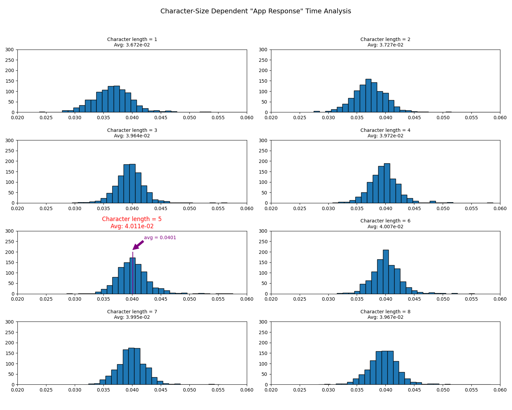

# POC of a timing attack
Let's imagine this situation: imagine that the log-in of an application is protected by a password and it is not 'well designed' so you can brute-force it.

You could just do a dictionary attack or something similar, but you presume that the implementation of the log-in (in the end, nothing more than comparing your password against the one in the DB) is custom and password are saved in plain-text in the db.

Is there any trick to determine the length of the password? **TIMING ATTACK!**

* When doing the comparison, the first thing the code checks is whether both strings (password and user_input) have the same length, so if both strings have the same length then the process will jump to comparing character_by_character
	* In that situation, the time spent by the app will change 'dramatically' and if we try enough to reduce statistical variance (latency and cpu-disponibility of the server we are bruteforcing) we should be able to detect this jump in the computing time spent.

In this example, the 'app' is a python script that compares user input with a hardcoded string 'aeiou'. Over that I have done a simple bash script to measure time spent executing this file (simulating the request to the server).

The statistical is simple, I will record the time spent to receive the *response* of the *server time.py* for an input on 1-character-long, 2-characters-long...

1. I will measure the time and plot the distribution, **TimevsChar_length**.
2. To reduce the variance I will make a 'huge' number of request per character_length (e.g. 100, 1000, 10000) and compute the average. 


>In this situation, the [central limit theorem](https://en.wikipedia.org/wiki/Central_limit_theorem) tells me that the variance should reduce with the sqrt(N) where N is the sample size (1000 in this case).
 Of course, the variance is dependant on lots of things (such as your cpu stability or server request variance time, ping...) but with a sufficient ammount of tries, you can make it unrelevant.

3. Even thought it is expected that the longer the user_input, the more time the server takes to process it, we should detect nevertheless the gap of succeding with the key_length.

ALERT!!!: Super_simple POC (proof of concept), real situations should consider more factors like day-time of the request (to eliminate the bias of traffic time difference at different hours/week_days...)


# 'App' code 
1. Application code, string comparison.
```python
import sys
if __name__ == "__main__":
    if len(sys.argv) != 2:
        print("Usage: python time.py <string>")
        sys.exit(1)

    user_input = sys.argv[1] #input from user.
    password = 'aeiou' # password, 5 chars long.

    result = user_input == password

    print(f"Strings are equal: {result}") # 'app' response.
```
2. Automating measure the time of the response
```shell
start=$(date +%s.%N)
python3 ./app_simulated.py $1 > /dev/null #we don't need to see the output of the app, if any; only time spent
end=$(date +%s.%N)
#echo "Time taken: $(echo "$end - $start" | bc) seconds"
echo "$end - $start" | bc

```
3. How to get the statistical distributions depending on the character length.
```bash
> for elto in z zz zzz zzzz zzzzz zzzzzz zzzzzzz zzzzzzzz; do echo "voy por $elto"; for i in {1..1000}; do ./measure_time_request.sh $elto | tail -n1 | grep -o '\.[0-9]*' >> "results_$elto.txt"; done ;done

```
Here we get a *'representative sample of requests'* for 8 different lengths of characters. We expect to find out that the key_length is probably 5_chars_long.

---

# Results
So, to sum it up, we have tried 'only 1000 times, so we haven't even tried 10000 times (remember that [rockyou.txt wordlist](https://github.com/danielmiessler/SecLists) has more than **10 million passwords**)
```bash
> wc -l results_z*
 1000 results_z.txt
 1000 results_zz.txt
 1000 results_zzz.txt
 1000 results_zzzz.txt
 1000 results_zzzzz.txt
 1000 results_zzzzzz.txt
 1000 results_zzzzzzz.txt
 1000 results_zzzzzzzz.txt
 8000 total
```

So, we have tried a trivial (easy to hide) amount of passwords, did we get anything?

## Distribution of time of 'app response' when changing character size


So it was true even with a small effort you can differenciate the password length!

I want to make clear a bunch of things:
1. The hypothetical situation doesn't apply when passwords are hashed (so all of them have the same length) but this is not only applicable to passwords but to any *secret* in the target system that is being used internally in a **string-comparison**.
2. This technique can be used to discover the **key itselft character by character**: after comparing the key length, the code will compare each character 1 by 1 so, using the same principle; if it happends that you randomly guess the first character, the app will check the 2nd and so on (investing more time). So we would be able to discover the password by looking at the time the app needs to answer.
3. As Abraham Lincoln said, *'Don't believe everything you read on the internet'*

To fix this can even easier than applying this technique, you don't need a WAF or something expensive, just make the app to invest constant times when comparing important characters (defense in depth, you now).

---
### Notes
* bc (used in the shell script) "is  a language that supports arbitrary precision numbers with interactive execution of statements." [Link](https://manpages.ubuntu.com/manpages/focal/en/man1/bc.1.html#:~:text=bc%20is%20a%20language%20that,defined%20before%20processing%20any%20files.)
* Linkedin [Article](https://www.linkedin.com/pulse/timing-attack-educative-introduction-javier-besc%2525C3%2525B3s-artigas%3FtrackingId=bOGXTrd8Rje3PfOxwZntPA%253D%253D/?trackingId=bOGXTrd8Rje3PfOxwZntPA%3D%3D)